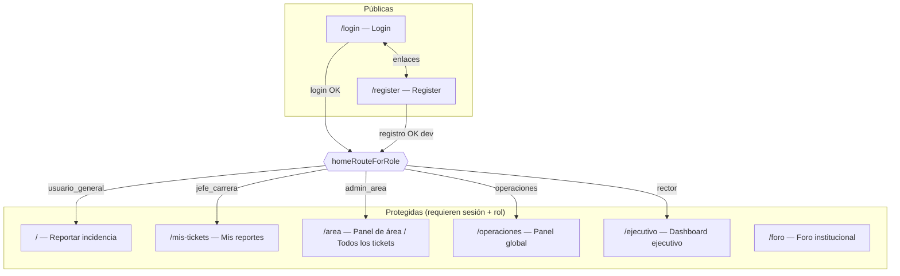
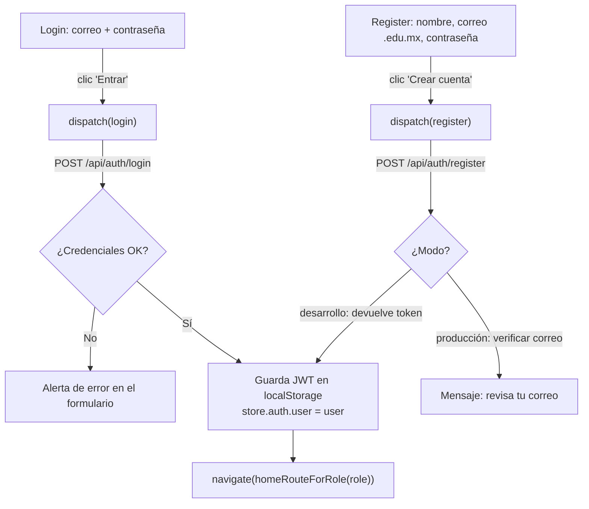
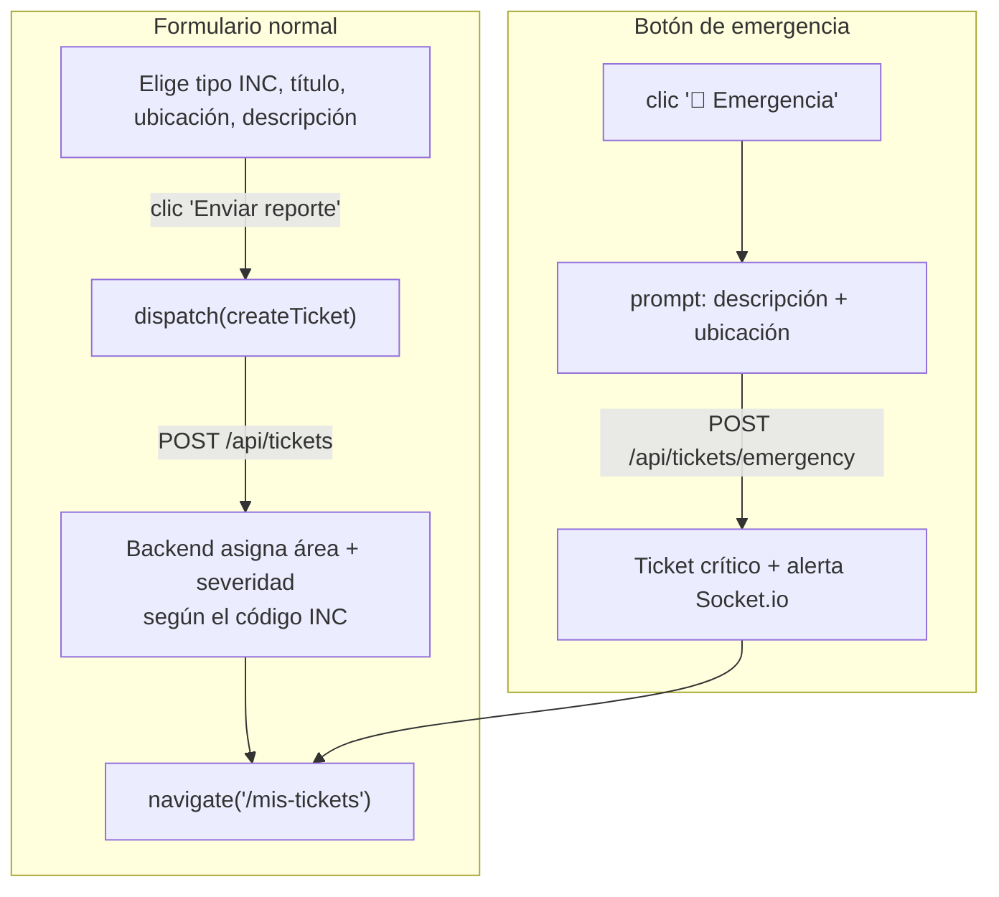
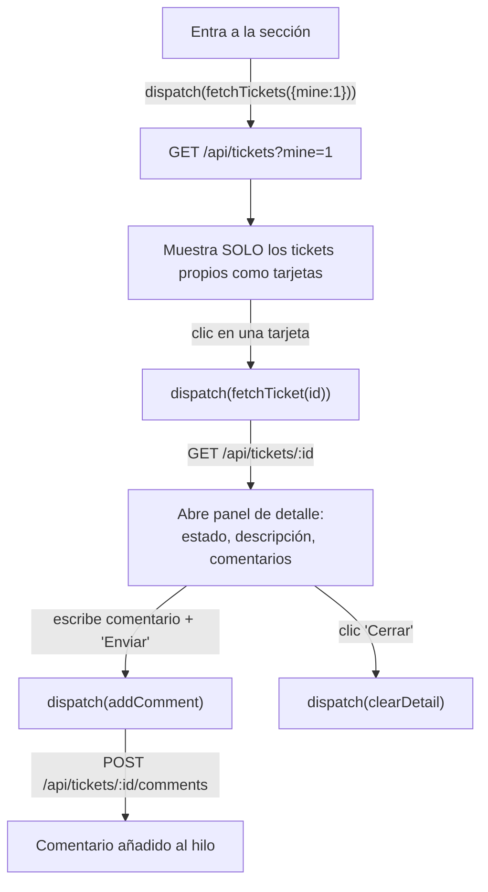
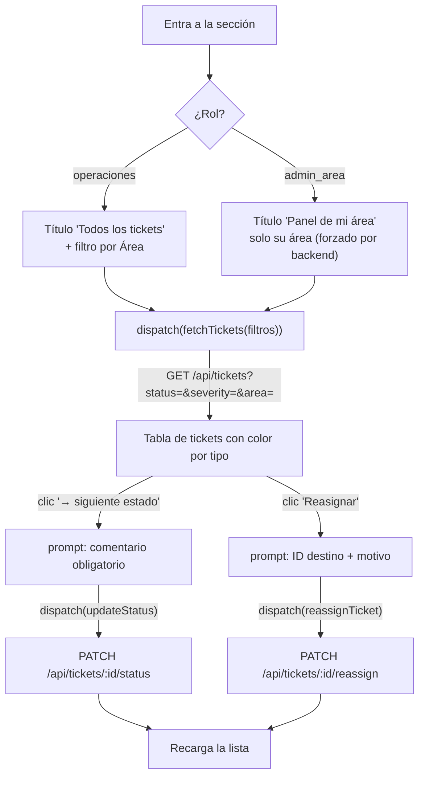
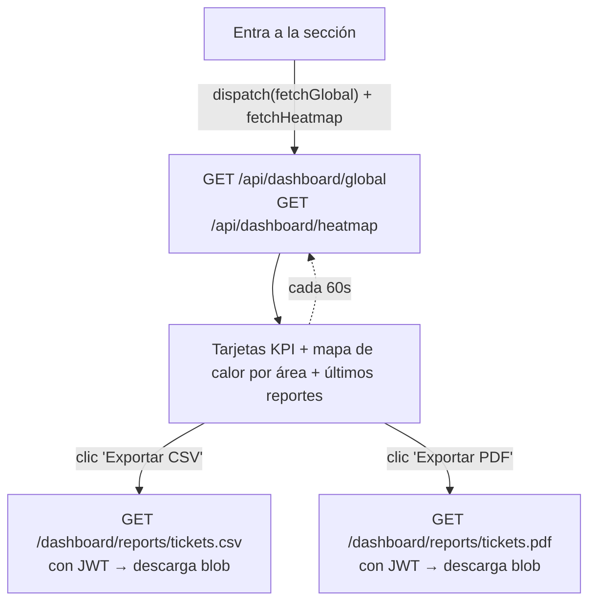
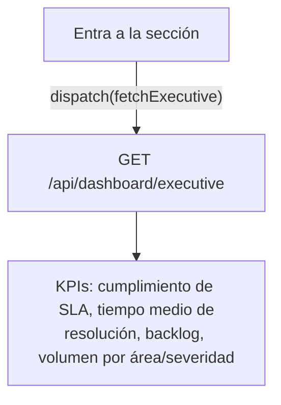
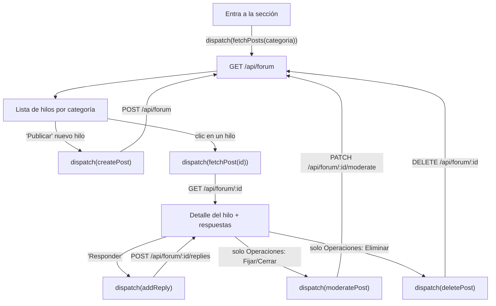
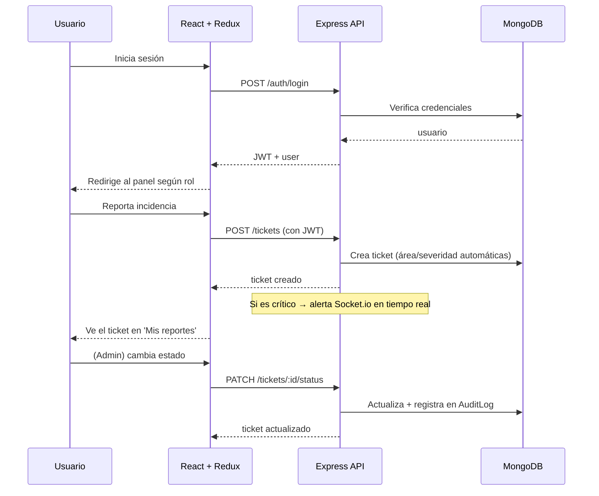

# Flujo de la aplicación — SIG-I

Recorrido funcional del sistema: cómo entra el usuario, cómo se mueve entre
secciones y **qué ocurre al pulsar cada botón**. La navegación se resuelve con
`react-router-dom` y el estado con **Redux Toolkit** (slices `auth`, `tickets`,
`forum`, `dashboard`).

---

## 1. Mapa general de rutas

`ProtectedRoute` vigila cada ruta protegida:
- **Sin sesión** → redirige a `/login`.
- **Con sesión pero rol no autorizado** → redirige a `/`.

---

## 2. Autenticación (Módulo A)

- Al cargar la app, `AuthProvider` despacha `loadMe()` → `GET /api/auth/me` para
  restaurar la sesión si hay token guardado.
- **Botón "Salir"** (Navbar) → `dispatch(logout())` borra el token y navega a `/login`.

---

## 3. Barra de navegación (enlaces según rol)

El `Navbar` muestra **solo** las secciones permitidas para el rol:

| Enlace | Ruta | Roles que lo ven |
|--------|------|------------------|
| Reportar | `/` | usuario_general, jefe_carrera, operaciones |
| Mis reportes | `/mis-tickets` | usuario_general, jefe_carrera, operaciones |
| Panel de área / **Tickets** | `/area` | admin_area, operaciones |
| Operaciones | `/operaciones` | operaciones |
| Ejecutivo | `/ejecutivo` | rector, operaciones |
| Foro | `/foro` | todos |
| Salir | — | todos (cierra sesión) |

---

## 4. Reportar incidencia (Módulo B) — ruta `/`

- El **color de la orilla** del selector cambia según el tipo de incidencia elegido.
- Tras enviar, el usuario aterriza en **Mis reportes** para ver su ticket recién creado.

---

## 5. Mis reportes (Módulo B) — ruta `/mis-tickets`

> `?mine=1` fuerza que **cualquier** rol vea aquí únicamente lo que él reportó.

---

## 6. Panel de área / Todos los tickets (Módulo C) — ruta `/area`

- Flujo de estados unidireccional: **abierto → en_proceso → resuelto → cerrado**
  (cada cambio exige comentario). Solo Operaciones puede regresar de resuelto a en_proceso.

---

## 7. Panel global (Módulo D) — ruta `/operaciones`

- Refresco automático cada **60 segundos**.
- Los reportes se descargan con `fetch` autenticado (adjunta el JWT) y se fuerza
  la descarga del archivo generado por el backend.

---

## 8. Dashboard ejecutivo (Módulo D) — ruta `/ejecutivo`

Solo lectura (rol Rector / Operaciones). El color del % de SLA cambia:
verde ≥90 %, naranja ≥70 %, rojo por debajo.

---

## 9. Foro institucional (Módulo E) — ruta `/foro`

- **Publicación anónima**: el autor real se oculta a todos salvo a Operaciones.
- **Respuesta oficial** (etiqueta verde): solo admin de área / Operaciones.

---

## 10. Ciclo completo (resumen)

---

### Notas clave del flujo
- **Todo** pasa por el cliente API central ([frontend/src/api/client.js](frontend/src/api/client.js)),
  que adjunta el JWT automáticamente.
- Cada acción de UI despacha un **thunk de Redux**; el estado resultante actualiza
  la vista sin recargar la página.
- El backend **siempre** re-verifica permisos por rol (un admin de TI nunca verá
  tickets de otra área, aunque manipule la petición).
